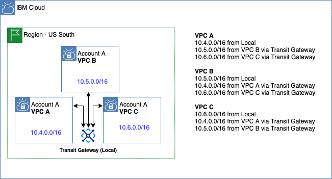
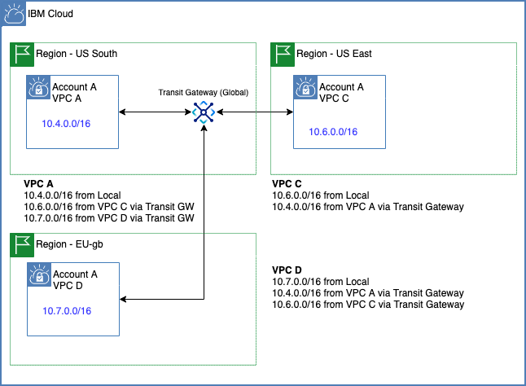
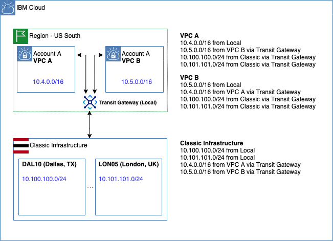
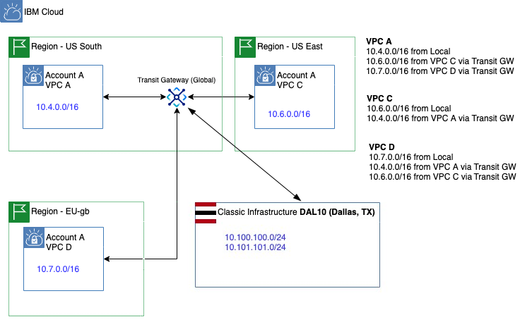

---

copyright:
  years: 2020
lastupdated: "2020-04-16"

keywords: transit, gateway, about, features, overview

subcollection: transit-gateway

---

{:shortdesc: .shortdesc}
{:new_window: target="_blank_"}
{:codeblock: .codeblock}
{:pre: .pre}
{:screen: .screen}
{:tip: .tip}
{:note: .note}
{:important: .important}
{:download: .download}
{:term: .term}

# About IBM Cloud Transit Gateway
{: #about}

As the number of your Virtual Private Clouds (VPCs) grow, you need an easy way to manage the interconnection between these resources, both locally and globally. {{site.data.keyword.tg_full}} is designed specifically for this purpose.
{: shortdesc}

With {{site.data.keyword.tg_full_notm}}, you can create a single or multiple transit gateways to connect VPCs together. You can also connect your {{site.data.keyword.cloud_notm}} classic infrastructure to a transit gateway to provide seamless communication with classic infrastructure resources. Any new network you connect to a transit gateway is then automatically made available to every other network connected to it. This makes it easy to scale your network as it grows.

## Overview of features
{: #feature-overview}

{{site.data.keyword.tg_full_notm}} offers the following features:

### Routing
{: #routing}

{{site.data.keyword.tg_full_notm}} supports local and global routing between VPCs and the {{site.data.keyword.cloud_notm}} Classic infrastructure. All routing options remain within the private {{site.data.keyword.cloud_notm}} infrastructure without operating on the public internet, and are optimized for performance. {{site.data.keyword.tg_full_notm}} allows customers greater flexibility, redundancy, and speed in scaling their workloads, as well as in connecting isolated networks running on {{site.data.keyword.cloud_notm}}.

### Privacy

* Connections to and from an {{site.data.keyword.tg_full_notm}} on the IBM private network are not exposed to the public internet. This reduces public egress and VPN costs as well as reduces security threats.

* {{site.data.keyword.tg_full_notm}} is a fully redundant, fault-tolerant service with no single point of failure within the {{site.data.keyword.cloud_notm}} Multi-Zone Regions (MZR) `us-south` (Dallas), `us-east` (Washington D.C.), `eu-de` (Frankfurt), `jp-tok` (Tokyo), and `au-syd` (Sydney).

* {{site.data.keyword.tg_full_notm}} integrates with Identity and Access Management (IAM), letting you manage access to your transit gateway. Using IAM, you can create and manage [{{site.data.keyword.cloud_notm}} users and groups](/docs/transit-gateway?topic=transit-gateway-iam), as well as use permissions to allow or deny their access.

## Interconnectivity patterns

{{site.data.keyword.tg_full_notm}} enables you to connect {{site.data.keyword.cloud_notm}} VPCs and classic infrastructure to transit gateways, allowing you to build global networks of multiple VPCs and classic infrastructure resources across {{site.data.keyword.cloud_notm}} regions to keep up with your business needs. {{site.data.keyword.tg_full_notm}} works across both {{site.data.keyword.cloud_notm}} generation 1 and generation 2 VPCs as well as IBM classic networks.

{{site.data.keyword.tg_full_notm}} can connect to classic networks located in any MZR, regardless of the location of the transit gateway or the routing type specified.
{: note}

Here are a few ways you can implement the {{site.data.keyword.tg_full_notm}} service.

### Use case 1: Interconnect two or more VPCs in the same MZR

### Use case 2: Interconnect two or more VPCs across multiple MZRs

### Use case 3: Interconnect one or more VPCs in the same MZR and an IBM classic network

### Use case 4: Interconnect VPCs and an IBM classic network to access all your resources across all MZRs

