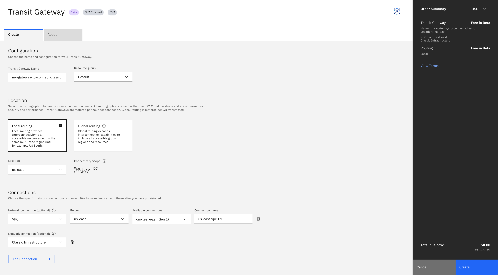

---

copyright:
  years: 2019
lastupdated: "2020-01-13"

keywords: transit, gateway, connecting, vpc, classic infrastructure

subcollection: transit-gateway

---

{:shortdesc: .shortdesc}
{:new_window: target="_blank_"}
{:codeblock: .codeblock}
{:pre: .pre}
{:screen: .screen}
{:tip: .tip}
{:note: .note}
{:important: .important}
{:download: .download}
{:external: target="_blank_" .external}
{:term: .term}

# Connecting VPCs to your IBM Cloud classic infrastructure
{: #connecting-classic-infrastructure-vpcs}

To use the IBM Cloud™ Transit Gateway capability with the IBM Cloud classic infrastructure, you must have at least one IBM Cloud Virtual Private Cloud (VPC) associated with your IBM Cloud account in the IBM Cloud private network, and your classic account must be linked to your IBM Cloud account.
{: shortdesc}

Refer to [Linking IBMid accounts](/docs/account?topic=account-unifyingaccounts) for more information on linking your classic account.

You can set up access to your IBM Cloud classic infrastructure with only one transit gateway in your IBM Cloud account.
{: tip}

All subnets of the VPC and classic network will be connected to your transit gateway, so it's important that the subnets do not overlap. When creating VPCs that are intended to be connected to a transit gateway, create them with non-overlapping prefixes and unique subnets. All subnets in a VPC are shared in the classic infrastructure VRF, which uses IP addresses in the `10.0.0.0/8` space. To avoid IP address conflicts, do not use IP addresses in the `10.0.0.0/14`, `10.200.0.0/14`, `10.198.0.0/15`, and `10.254.0.0/16` blocks. To view a list of your classic infrastructure subnets, see [View all subnets](/docs/infrastructure/subnets?topic=subnets-view-all-subnets){: external}.
{: tip}

In order to use the transit gateway capability with your classic infrastructure, your account must be enabled for virtual routing and forwarding (VRF). For information on enabling your account for VRF, refer to [Enabling VRF and service endpoints](/docs/account?topic=account-vrf-service-endpoint).
{: important}

To connect your VPCs to your IBM Cloud classic infrastructure using a transit gateway, perform the following procedure:

1. From your browser, open the [IBM Cloud console](https://cloud.ibm.com/catalog){: external} and log in to your account.
2. Select **Networking** from the left, then click the Transit Gateway tile to bring up the Transit Gateway ordering page.

You can also access the ordering page from the [IBM Cloud catalog ](https://cloud.ibm.com){:new_window} by selecting the Menu icon  from the top left, then selecting **Hybrid Networking** to bring up the Direct Link page. From there, select **Transit Gateway** in the left navigation panel, then click the **Order Transit Gateway** button.
{: note}

3. From the ordering page, enter a name for the transit gateway, and select your resource group. You can choose a resource group from the list, or keep the default selection.
4. Select either **Local** or **Global** routing, depending on your needs.
  Select local routing if you want this transit gateway to only connect VPCs in the same region. Select global routing to connect VPCs in different regions.

  All routing options remain within the IBM Cloud infrastructure and are optimized for security and performance.
  {: note}

5. Choose your location.

## Connecting classic infrastructure and VPCs
{: #connecting-vpcs-classic-infrastructure}

You can now choose and configure the additional network connections you want to add to your transit gateway:
1. Select the **classic infrastructure** network connection type from the list.
2. Click **Add Connection**.
3. From the list, select the **VPC** network connection type.
4. Select your region from the list.
  If you select **Local** routing, the list contains regions that are local to the transit gateway location you specified. If you select **Global**, then it lists all regions available globally.
5. Select an available connection to connect to the transit gateway.
6. Name the network connection, or leave the name blank and the VPC name is used.

  Perform these steps for every connection that you want to add. You can also [add connections](/docs/infrastructure/transit-gateway?topic=transit-gateway-adding-connections) after you've created the transit gateway.

  The VPC you want to connect and the IBM Cloud classic infrastructure cannot already be connected to a different transit gateway in your account.
  {: tip}

  You cannot connect a [classic access VPC](/docs/vpc?topic=vpc-setting-up-access-to-classic-infrastructure) to a transit gateway.
  {: important}

7. View the Terms and Conditions on the right side of the page.
8. Click **Create**.

    
