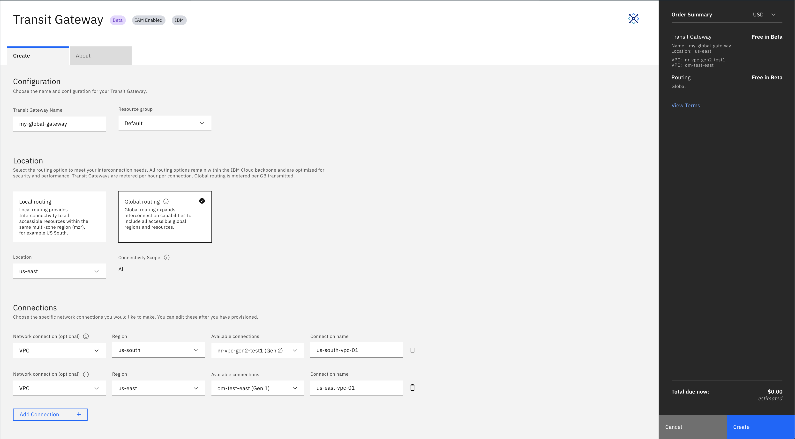

---

copyright:
  years: 2020
lastupdated: "2020-01-14"

keywords: transit, gateway, vpc, connecting, different

subcollection: transit-gateway

---

{:shortdesc: .shortdesc}
{:new_window: target="_blank_"}
{:codeblock: .codeblock}
{:pre: .pre}
{:screen: .screen}
{:tip: .tip}
{:note: .note}
{:important: .important}
{:download: .download}
{:external: target="_blank_" .external}
{:term: .term}

# Connecting VPCs in different regions
{: #connecting-different-vpcs}

Using IBM Cloud™ Transit Gateway, you can connect two or more IBM Cloud Virtual Private Clouds (VPCs) in different regions if they are associated with your IBM Cloud account in the IBM Cloud private network.
{: shortdesc}

All subnets of the VPC and classic network will be connected to the transit gateway, so it's important that the subnets do not overlap. When creating VPCs that are intended to be connected to a transit gateway, make sure and create the VPCs with non-overlapping prefixes and unique subnets.
{: important}

To connect VPCs in different regions to a transit gateway, perform the following procedure:

1. From your browser, open the [IBM Cloud console](https://cloud.ibm.com/catalog){: external} and log in to your account.
2. Select **Networking** from the left, then click the Transit Gateway tile to bring up the Transit Gateway ordering page.

You can also access the ordering page from the [IBM Cloud catalog ](https://cloud.ibm.com){:new_window} by selecting the Menu icon  from the top left, then selecting **Hybrid Networking** to bring up the Direct Link page. From there, select **Transit Gateway** in the left navigation panel, then click the **Order Transit Gateway** button.
{: note}

3. From the ordering page, enter a name for the transit gateway and select your resource group. You can select a resource group from the list, or keep the default selection.
4. Select **Global Routing**.
  Global routing expands interconnection capabilities to include all accessible global regions and resources.
  {: note}
5. Select your location.

## Connecting the VPCs
{: #connecting-vpcs-different}

You can now choose and configure the specific network connections that you want to add to your transit gateway:
1. From the list, choose the **VPC** network connection type.
2. Choose your region from the list. The list contains all regions that are available globally to the Transit Gateway location you specified.
3. Select an available connection to connect to the transit gateway.
4. Name the network connection, or leave the name blank and the VPC name is used.

  For every additional connection you'd like to add, click **Add Connection** and perform these steps. You can also [add connections](/docs/infrastructure/transit-gateway?topic=transit-gateway-adding-connections) after you've created the transit gateway.

  The VPC that you want to connect cannot already be connected to a different transit gateway in your account.
  {: tip}

  You cannot connect a [classic access VPC](/docs/vpc?topic=vpc-setting-up-access-to-classic-infrastructure) to a transit gateway.
  {: important}

6. View the Terms and Conditions on the right side of the page.
7. Click **Create**.

    
