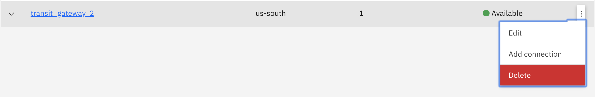
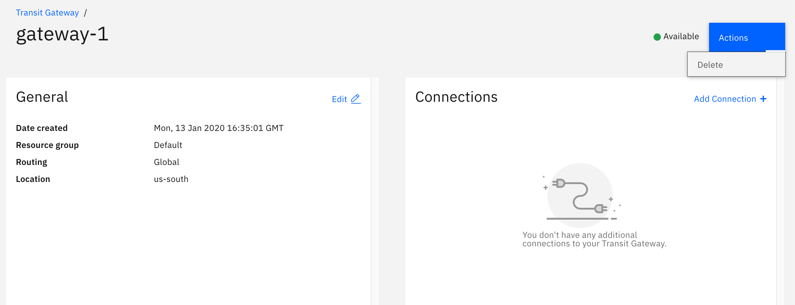

---

copyright:
  years: 2020
lastupdated: "2020-04-16"

keywords: transit, gateway, deleting

subcollection: transit-gateway

---

{:shortdesc: .shortdesc}
{:new_window: target="_blank"}
{:codeblock: .codeblock}
{:pre: .pre}
{:screen: .screen}
{:tip: .tip}
{:note: .note}
{:important: .important}
{:download: .download}
{:external: target="_blank" .external}
{:term: .term}
{:help: data-hd-content-type='help'}
{:support: data-reuse='support'}

# Deleting a transit gateway
{: #delete-gateway}
{: help}
{: support}

To delete an {{site.data.keyword.tg_full}}, follow these steps.
{: shortdesc}

1. From your browser, open the [{{site.data.keyword.cloud_notm}} console](https://cloud.ibm.com){:external} and log in to your account.
2. Select the Menu icon  on the upper left of the page, then click **Interconnectivity**.
3. Click **Transit Gateway**.
4. Click the name of the transit gateway you want to delete.
5. Ensure the transit gateway has no attached connections - if it does, delete all connections.
  For each connection you want to delete, click the Actions menu next to it, then select **Delete**.
6. After the connections are removed, you can delete the transit gateway in two ways:
  * From the transit gateway's details page, click the Options menu icon  next to the gateway you want to delete and select **Delete**.

  

  * From an individual transit gateway page, select **Actions > Delete**.

  
