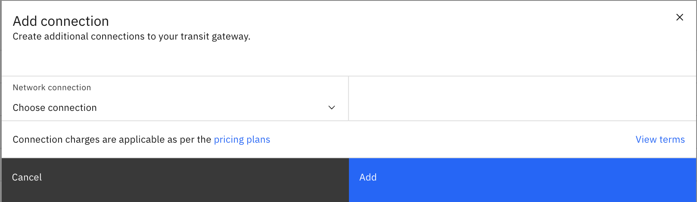
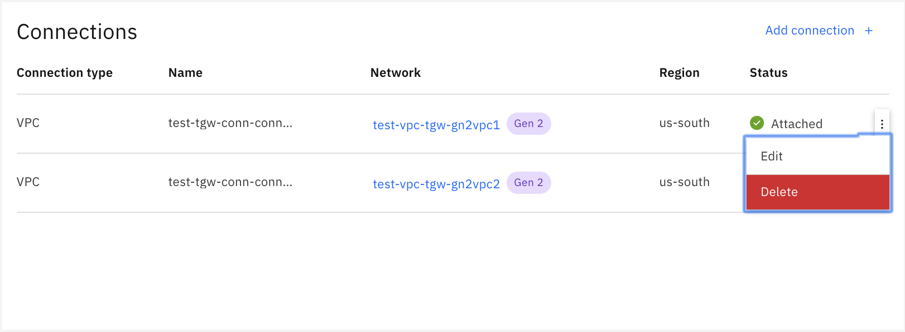
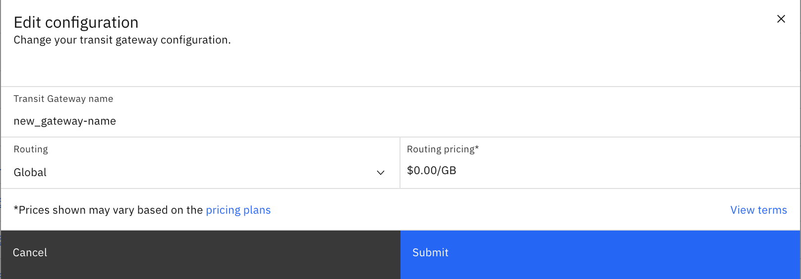

---

copyright:
  years: 2020
lastupdated: "2020-04-16"

keywords: transit, gateway, editing

subcollection: transit-gateway

---

{:shortdesc: .shortdesc}
{:new_window: target="_blank"}
{:codeblock: .codeblock}
{:pre: .pre}
{:screen: .screen}
{:tip: .tip}
{:note: .note}
{:important: .important}
{:download: .download}
{:external: target="_blank" .external}
{:term: .term}

# Managing transit gateways
{: #edit-gateway}

You can add, edit, or delete connections and edit your gateways from your {{site.data.keyword.tg_full}} using the {{site.data.keyword.cloud_notm}} console.
{: shortdesc}

## Adding a connection
{: #adding-connections}

To add a connection to a transit gateway, perform the following procedure:
1. From your browser, open the [{{site.data.keyword.cloud_notm}} console](https://cloud.ibm.com){:external} and log in to your account.
2. Select the Menu icon  from the upper left, then click **Interconnectivity**.
3. Click **Transit Gateway** from the left navigation pane.
4. Click the name of the transit gateway where you want to add a connection.

  If you are in the expanded view, click **View details**.
  {: tip}

5. Click **Add connection**.

You can now choose and configure the specific network connections that you want to add to your transit gateway.

## Editing a connection
{: #editing-connections}

To edit a connection to a transit gateway, perform the following procedure:
1. From your browser, open the [{{site.data.keyword.cloud_notm}} console](https://cloud.ibm.com){:external} and log in to your account.
2. Select the Menu icon  from the upper left, then click **Interconnectivity**.
3. Click **Transit Gateway** from the left navigation pane.
4. Click the name of the transit gateway where you want to edit a connection.

  If you are in the expanded view, click **View details**.
  {: tip}

5. From the Connections page, click the Options menu icon  next to the connection you want to edit and select **Edit**.

From here you can change the name of the selected network connection.

## Deleting a connection
{: #deleting-connections}

To delete a connection from a transit gateway, perform the following procedure:
1. From your browser, open the [{{site.data.keyword.cloud_notm}} console](https://cloud.ibm.com){:external} and log in to your account.
2. Select the Menu icon  from the upper left, then click **Interconnectivity**.
3. Click **Transit Gateway** from the left navigation pane.
4. Click the name of the transit gateway where you want to delete a connection.

  If you are in the expanded view, click **View details**.
  {: tip}

5. From the Connections page, click the Options menu icon  next to the connection you want to delete and select **Delete**.

## Changing your configuration
{: #change-configuration}

To change your transit gateway configuration, perform the following procedure:
1. From your browser, open the [{{site.data.keyword.cloud_notm}} console](https://cloud.ibm.com){:external} and log in to your account.
2. Select the Menu icon  from the upper left, then click **Interconnectivity**.
3. Click **Transit Gateway** from the left navigation pane.
4. Click the name of the transit gateway you want to edit.

  If you are in the expanded view, click **View details**.
  {: tip}

5. Click **Edit**.

From here you can change the gateway's name, as well as its routing type (Local or Global).

To change a transit gateway's routing type from Global to Local, you must delete any connections that are not local to the transit gateway's location.
{: tip}

When changing from Local to Global routing for a given transit gateway, you will be charged for all associated connection traffic.
{: important}

