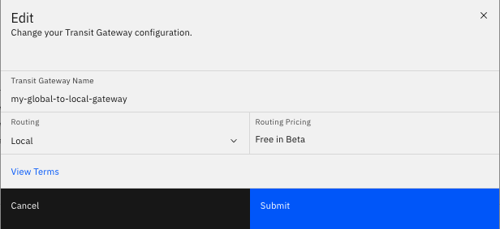

---

copyright:
  years: 2020
lastupdated: "2020-01-14"

keywords: transit, gateway, editing

subcollection: transit-gateway

---

{:shortdesc: .shortdesc}
{:new_window: target="_blank_"}
{:codeblock: .codeblock}
{:pre: .pre}
{:screen: .screen}
{:tip: .tip}
{:note: .note}
{:important: .important}
{:download: .download}
{:external: target="_blank_" .external}
{:term: .term}

# Managing your transit gateways
{: #edit-gateway}

You can add or delete connections from your transit gateways using the IBM Cloud™ console.
{: shortdesc}

## Deleting connections
{: #deleting-connections}

To delete connections from your transit gateway:
1. From your browser, open the [IBM Cloud catalog ](https://cloud.ibm.com){:new_window} and log into your account.
2. Select the Menu icon  from the top left, then click **Hybrid Networking** to bring up the Direct Link page.
3. Click **Transit Gateway** from the left navigation panel.
4. Click the name of the transit gateway you want to edit.

  If you are in the expanded view, click **View Full Details**.
  {: tip}

5. To delete a connection, click the trashcan icon  next to its name.
6. Confirm that you want to delete the connection.

## Adding connections
{: #adding-connections}

To add connections to your transit gateway:
1. From your browser, open the [IBM Cloud catalog ](https://cloud.ibm.com){:new_window} and log into your account.
2. Select the Menu icon  from the top left, then click **Hybrid Networking** to bring up the Direct Link page.
3. Click **Transit Gateway** from the left navigation panel.
4. Click the name of the transit gateway you want to edit.

  If you are in the expanded view, click **View Full Details**.
  {: tip}

5. Click **Add Connection** in the Connections panel.

You can now choose and configure the specific network connections that you want to add to your transit gateway. For information on adding VPCs in different scenarios, refer to the following sections, based on your needs:

* [Connecting VPCs in the same region](/docs/infrastructure/transit-gateway?topic=transit-gateway-connecting-vpcs)
* [Connecting VPCs in different regions](/docs/infrastructure/transit-gateway?topic=transit-gateway-connecting-vpcs-different)
* [Connecting VPCs to your IBM Cloud classic infrastructure](/docs/infrastructure/transit-gateway?topic=transit-gateway-connecting-vpcs-classic-infrastructure)

## Changing your configuration
{: #change-configuration}

To change your transit gateway configuration:
1. From your browser, open the [IBM Cloud catalog ](https://cloud.ibm.com){:new_window} and log into your account.
2. Select the Menu icon  from the top left, then click **Hybrid Networking** to bring up the Direct Link page.
3. Click **Transit Gateway** from the left navigation panel.
4. Click the name of the transit gateway you want edit.

  If you are in the expanded view, click **View Full Details**.
  {: tip}

5. Click **Edit**.

From here you can change the gateway's name, as well as its routing type (Local or Global).

Changing your transit gateway's routing type from Global to Local requires that any connections that are not local to the
transit gateway's location be deleted for the action to succeed.
{: important}
