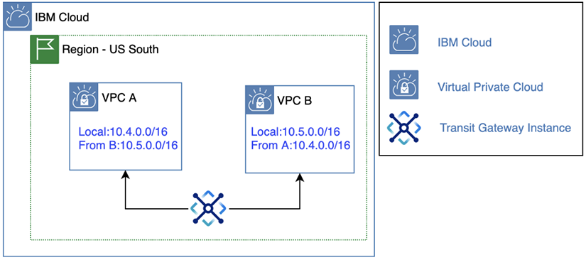
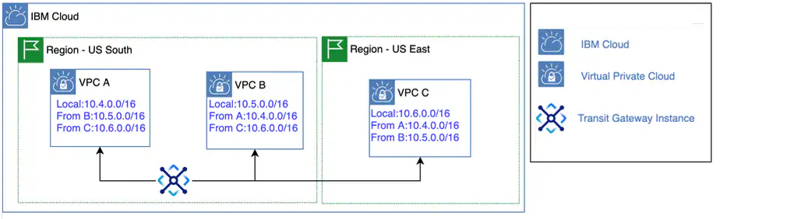

---

copyright:
  years: 2020
lastupdated: "2020-04-16"

keywords: transit, gateway, help, tips, connections, provision

subcollection: transit-gateway

---

{:shortdesc: .shortdesc}
{:new_window: target="_blank"}
{:codeblock: .codeblock}
{:pre: .pre}
{:screen: .screen}
{:tip: .tip}
{:note: .note}
{:important: .important}
{:download: .download}
{:term: .term}

# Planning for IBM Cloud Transit Gateway
{: #helpful-tips}

Make sure that you review the following considerations before ordering your {{site.data.keyword.tg_full}}.
{: shortdesc}

## Service limits
{: #service-limits}

Keep in mind the following service limits while using IBM Cloud Transit Gateway.

| Service limit |  Default |
|---------------------------|------|
| Number of transit gateways | 5 gateways per account, 2 gateways per region |
| Number of connections per transit gateway |  10 IBM Cloud VPCs per gateway, 1 IBM Cloud classic infrastructure connection |
| Number of prefixes per connection | 15 prefixes for VPC connections, 120 prefixes for a classic connection |
{: caption="Table 1. IBM Cloud Transit Gateway service limits" caption-side="top"}

You can open a [support ticket](/docs/get-support?topic=get-support-getting-customer-support) if you need your service limits expanded.
{: note}

## General considerations

All subnets of the VPC and classic network will connect to the transit gateway, so it's important that the subnets do not overlap. When creating VPCs that are intended to connect to a transit gateway, make sure to create the VPCs with non-overlapping prefixes and unique subnets.
{: important}

* {{site.data.keyword.tg_full_notm}} supports provisioning transit gateways in the following regions: `us-south`, `us-east`, `eu-de`, `eu-gb`, `au-syd`, and `jp-tok`.
* Create your transit gateway in a location that makes sense for your workload. For example, if you are connecting two VPCs in the `us-south` (Dallas) region and one VPC in the `eu-de` (Frankfurt) region, creating your gateway in `us-south` region would be the most efficient for your workload.
* Be descriptive when naming your transit gateway connections. If you do not specify a name when adding a connection, the VPC name is used by default.
* You cannot connect a [classic access VPC](/docs/vpc?topic=vpc-setting-up-access-to-classic-infrastructure) directly to a transit gateway. To connect the classic resources, use the {{site.data.keyword.cloud_notm}} classic infrastructure connection, and then all the resources in your classic access VPC are automatically connected.  
* Even though you can have multiple transit gateways per account, a VPC or classic infrastructure can only be added to one transit gateway.
* Transit gateways and their connections can take several minutes after provisioning before they are available.

## Classic infrastructure connection considerations

* To use a transit gateway to connect your VPCs to your IBM Cloud classic infrastructure, you must enable your classic account for virtual routing and forwarding (VRF) and link it to your IBM Cloud account. For information on enabling your account for VRF, see [Enabling VRF and service endpoints](/docs/account?topic=account-vrf-service-endpoint).

* When you connect a VPC and the classic infrastructure to a transit gateway, all subnets in the VPC become visible to the classic infrastructure VRF, which uses IP addresses in the `10.0.0.0/8` space. To avoid IP address conflicts, do not use IP addresses in your VPCs in the `10.0.0.0/14`, `10.200.0.0/14`, `10.198.0.0/15`, and `10.254.0.0/16` blocks. Also, don't use addresses from your classic infrastructure subnets. To view a list of your classic infrastructure subnets, see [View all subnets](/docs/subnets?topic=subnets-view-all-subnets).

* Classic VSIs may have both a private (`eth0`) and a public (`eth1`) network interface. Currently, the routing tables for these interfaces point the default gateway to the public interface (`eth1`). You might have to add routing entries to route the subnets from other VPCs through the private interface.

* All of your IBM Cloud classic infrastructure networks across [MZRs](/docs/overview?topic=overview-locations#mzr-table) are accessible through this connection, regardless of the location of the transit gateway or the routing type specified.

  Classic infrastructure resources that are not located in an MZR location will not have connectivity through the transit gateway.
  {: important}

* When classic infrastructure is connected to a transit gateway, it also includes any "Classic Access VPCs" attached to the account as well, because the subnets for these VPCs are associated with the classic infrastructure VRF. This is the only way to connect a transit gateway to a Classic Access VPC: by connecting the entire classic infrastructure to the transit gateway (instead of the specific Classic Access VPCs).

## Routing considerations

* All connections to a transit gateway are connected to each other, so carefully consider all resources you want to interconnect before deciding whether local or global routing is right for each gateway.

   Traffic from either routing option does not leave the private IBM Cloud network and is optimized for performance.
   {: note}

* If you plan to use your gateway to connect VPCs in the same multi-zone region ([MZR](/docs/overview?topic=overview-locations#mzr-table)), use local routing to provide connectivity to all accessible resources within the same MZR; for example, `us-south` (Dallas).

   {: caption="Figure 1. Simple local routing example" caption-side="bottom"}

* If you plan to use your gateway to connect VPCs between different [MZRs](/docs/overview?topic=overview-locations#mzr-table), use global routing to expand the connection capabilities to include all accessible global regions and resources.

   {: caption="Figure 2. Simple global routing example" caption-side="bottom"}

   Regardless of the routing type specified, {{site.data.keyword.tg_full_notm}} can connect to classic infrastructure networks located in any MZR. To achieve this, simply add the classic connection to your transit gateway.
   {: important}

* You can edit a gateway's routing type after it is provisioned. However, to change the routing type from global to local, you must first remove any global connections (that is, connections that are not in the same location as the gateway). Note that connections to the IBM Cloud classic infrastructure are always considered local.

* When changing from Local to Global routing, you will be charged for all associated global connections.
